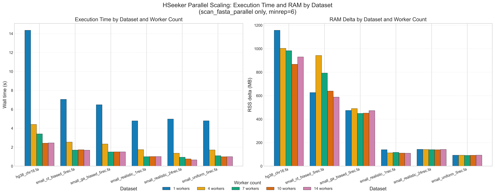

# Final Parallel Worker Sweep Report

**Date**: 2026-05-22 12:08:20  
**minrep**: 6  
**Workers swept**: 1, 4, 7, 10, 14  

## Scaling Figure

Figure note: RAM is reported as process RSS delta (MB) measured as RSS after run minus RSS before run for each worker setting. This captures memory growth attributable to each run, but it is not a true peak-RSS profile.

## System

| Property | Value |
|---|---|
| CPU logical cores | 14 |
| CPU physical cores | 14 |
| RAM total (GB) | 25.8 |
| RAM available (GB) | 9.3 |
| OS | macOS-15.7.7-arm64-arm-64bit |
| Python | 3.11.15 |
| hseeker | 0.1.0 |
| NumPy | 2.4.6 |

## Per-file Scaling

### hg38_chr16.fa (92.1 MB)

Hits consistent across workers: **True**

| Workers | Wall (s) | CPU (s) | Hits | Throughput (MB/s) | Speedup vs 1w | Efficiency |
|---|---|---|---|---|---|---|
| 1 | 14.456 | 14.443 | 938,118 | 6.37 | 1.00x | 100.0% |
| 4 | 4.407 | 14.873 | 938,118 | 20.91 | 3.28x | 82.0% |
| 7 | 3.316 | 14.908 | 938,118 | 27.79 | 4.36x | 62.3% |
| 10 | 2.500 | 15.168 | 938,118 | 36.85 | 5.78x | 57.8% |
| 14 | 2.447 | 16.472 | 938,118 | 37.66 | 5.91x | 42.2% |

### small_ct_biased_5rec.fa (30.5 MB)

Hits consistent across workers: **True**

| Workers | Wall (s) | CPU (s) | Hits | Throughput (MB/s) | Speedup vs 1w | Efficiency |
|---|---|---|---|---|---|---|
| 1 | 7.026 | 7.023 | 732,914 | 4.34 | 1.00x | 100.0% |
| 4 | 2.525 | 7.170 | 732,914 | 12.08 | 2.78x | 69.6% |
| 7 | 1.673 | 7.226 | 732,914 | 18.23 | 4.20x | 60.0% |
| 10 | 1.671 | 7.246 | 732,914 | 18.26 | 4.21x | 42.1% |
| 14 | 1.674 | 7.218 | 732,914 | 18.22 | 4.20x | 30.0% |

### small_ga_biased_5rec.fa (30.5 MB)

Hits consistent across workers: **True**

| Workers | Wall (s) | CPU (s) | Hits | Throughput (MB/s) | Speedup vs 1w | Efficiency |
|---|---|---|---|---|---|---|
| 1 | 6.457 | 6.456 | 592,812 | 4.72 | 1.00x | 100.0% |
| 4 | 2.335 | 6.630 | 592,812 | 13.06 | 2.77x | 69.1% |
| 7 | 1.503 | 6.700 | 592,812 | 20.30 | 4.30x | 61.4% |
| 10 | 1.486 | 6.666 | 592,812 | 20.53 | 4.35x | 43.5% |
| 14 | 1.498 | 6.718 | 592,812 | 20.36 | 4.31x | 30.8% |

### small_realistic_1rec.fa (30.5 MB)

Hits consistent across workers: **True**

| Workers | Wall (s) | CPU (s) | Hits | Throughput (MB/s) | Speedup vs 1w | Efficiency |
|---|---|---|---|---|---|---|
| 1 | 4.843 | 4.837 | 181,965 | 6.30 | 1.00x | 100.0% |
| 4 | 1.777 | 4.924 | 181,965 | 17.17 | 2.73x | 68.1% |
| 7 | 1.014 | 4.971 | 181,965 | 30.09 | 4.78x | 68.3% |
| 10 | 1.008 | 4.978 | 181,965 | 30.25 | 4.80x | 48.0% |
| 14 | 1.012 | 4.984 | 181,965 | 30.14 | 4.79x | 34.2% |

### small_realistic_24rec.fa (30.5 MB)

Hits consistent across workers: **True**

| Workers | Wall (s) | CPU (s) | Hits | Throughput (MB/s) | Speedup vs 1w | Efficiency |
|---|---|---|---|---|---|---|
| 1 | 4.953 | 4.950 | 222,438 | 6.16 | 1.00x | 100.0% |
| 4 | 1.364 | 5.091 | 222,438 | 22.36 | 3.63x | 90.8% |
| 7 | 0.936 | 5.103 | 222,438 | 32.57 | 5.29x | 75.6% |
| 10 | 0.752 | 5.185 | 222,438 | 40.54 | 6.58x | 65.8% |
| 14 | 0.651 | 5.497 | 222,438 | 46.84 | 7.61x | 54.3% |

### small_uniform_5rec.fa (30.5 MB)

Hits consistent across workers: **True**

| Workers | Wall (s) | CPU (s) | Hits | Throughput (MB/s) | Speedup vs 1w | Efficiency |
|---|---|---|---|---|---|---|
| 1 | 4.827 | 4.822 | 171,818 | 6.32 | 1.00x | 100.0% |
| 4 | 1.714 | 4.933 | 171,818 | 17.80 | 2.82x | 70.4% |
| 7 | 1.096 | 4.971 | 171,818 | 27.83 | 4.40x | 62.9% |
| 10 | 0.986 | 4.975 | 171,818 | 30.95 | 4.90x | 49.0% |
| 14 | 1.011 | 5.058 | 171,818 | 30.17 | 4.78x | 34.1% |

## 14-worker Cross-file Summary

| File | Size (MB) | 1w wall (s) | 14w wall (s) | Speedup | Efficiency | Throughput 14w (MB/s) |
|---|---|---|---|---|---|---|
| hg38_chr16.fa | 92.1 | 14.456 | 2.447 | 5.91x | 42.2% | 37.66 |
| small_ct_biased_5rec.fa | 30.5 | 7.026 | 1.674 | 4.20x | 30.0% | 18.22 |
| small_ga_biased_5rec.fa | 30.5 | 6.457 | 1.498 | 4.31x | 30.8% | 20.36 |
| small_realistic_1rec.fa | 30.5 | 4.843 | 1.012 | 4.79x | 34.2% | 30.14 |
| small_realistic_24rec.fa | 30.5 | 4.953 | 0.651 | 7.61x | 54.3% | 46.84 |
| small_uniform_5rec.fa | 30.5 | 4.827 | 1.011 | 4.78x | 34.1% | 30.17 |

## Findings

- Best 14-worker speedup: **small_realistic_24rec.fa** at **7.61x**.
- Lowest 14-worker speedup: **small_ct_biased_5rec.fa** at **4.20x**.
- Hit counts were identical across all worker settings for every file.
